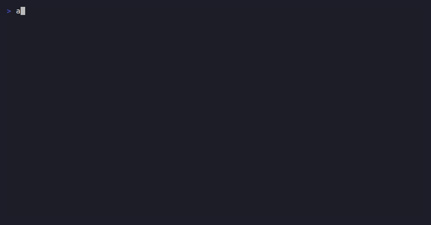

animedex
========

.. image:: https://img.shields.io/badge/license-Apache--2.0-green.svg
   :alt: Apache-2.0 license
   :target: https://github.com/deepghs/animedex/blob/main/LICENSE

A read-only, multi-source, ``gh``-flavored command-line interface for
anime and manga metadata. ``animedex`` is also a first-class Python
library: ``import animedex`` exposes the same backends, the same
source-attributed dataclasses, and the same raw-passthrough API that
the ``animedex`` console script uses.

The CLI is a thin presentation layer over the package: every command in
the GIF above also has a one-line Python equivalent, and every JSON
response carries ``_source`` annotations so a downstream automation
layer always knows which upstream produced which field.

Why animedex?
-------------

There are a dozen public anime APIs. AniList has the cleanest GraphQL
surface but degraded rate limits. Jikan scrapes MyAnimeList and is the
deepest catalogue. Trace.moe identifies a scene from a screenshot.
nekos.best curates SFW art. Each is great at one thing — and each
speaks a different protocol, has its own rate limit, and shapes
responses differently.

``animedex`` is one CLI (and one Python library) over all of them, with
three guarantees:

* **Source-attributed** — every datum on screen carries
  ``[src: anilist]`` / ``[src: jikan]`` / etc. No "merged answer";
  callers always know who told them what.
* **Read-only by project scope** — no ``add to list``, no
  ``set score``, no upload. Auth stays small; account state stays
  untouched.
* **Inform, do not gate** — rate limits, content classifications, and
  legal greys live in ``--help`` text and per-command Agent Guidance
  blocks. The CLI does not refuse, second-guess, or impose content
  filters on the user's behalf.

What works today
----------------

Four backends are wired up at the high-level command surface, with
eight at the raw-passthrough surface. The full list, command shapes
and rate-ceiling notes live in :doc:`tutorials/index`.

* ``animedex anilist ...`` — 28 anonymous endpoints + 4 auth-required
  stubs (until token storage lands).
* ``animedex jikan ...`` — 87 anonymous endpoints across the entire
  Jikan v4 surface.
* ``animedex trace ...`` — search by image, quota check.
* ``animedex nekos ...`` — categories, per-category random images
  / GIFs, fuzzy metadata search.
* ``animedex api <backend> <path>`` — raw passthrough for AniList,
  Jikan, Kitsu, MangaDex, Trace.moe, Danbooru, Shikimori, ANN, and
  nekos.best.

Documentation contents
----------------------

.. toctree::
   :maxdepth: 2

   installation
   quickstart
   tutorials/index
   api_doc/index

Project repository
------------------

* `Source on GitHub <https://github.com/deepghs/animedex>`_
* `Issue tracker <https://github.com/deepghs/animedex/issues>`_
* `CI runs <https://github.com/deepghs/animedex/actions>`_

Indices
-------

* :ref:`genindex`
* :ref:`modindex`
* :ref:`search`
